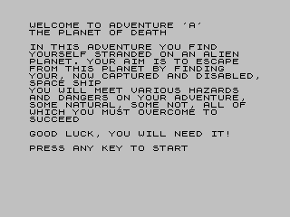

# Sjasm-AdventureA-ZXSpectrum-Game
All copyrights to source code own by Artic Computing Ltd, please contact with me if this repository violates the law in someway.
<figure></figure>
Source code of game disassembled with Ghidra and turn into SJASM format with https://github.com/shadwork/Ghidra-To-Asm-Converter 

After that - it tuned with bare hands and now games can be assembled with sjasm into runnable sna file. Result of assemble is byte-to-byte copy of original file, except additional runing block - that switch keyboard into letter mode insted of basic command.

```
LD HL,0x5C3b
LD (HL),0xCC
JP ENTRY_POINT
```

Main goal of this repository is played with assembler sources in modern world:
 - add localization
 - remove ROM dependency
 - support 40,64 and 80 columns
 - porting into msx
 - enchanced text parser

To build project you need invoke sjasmplus command and getting sna 

`sjasmplus adventurea.asm`

